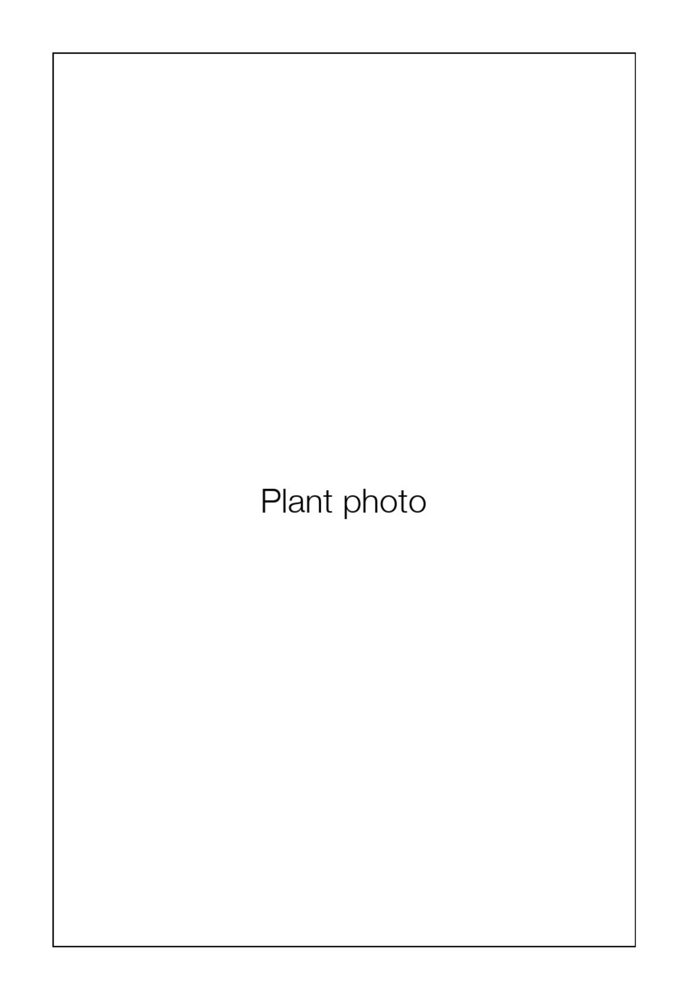
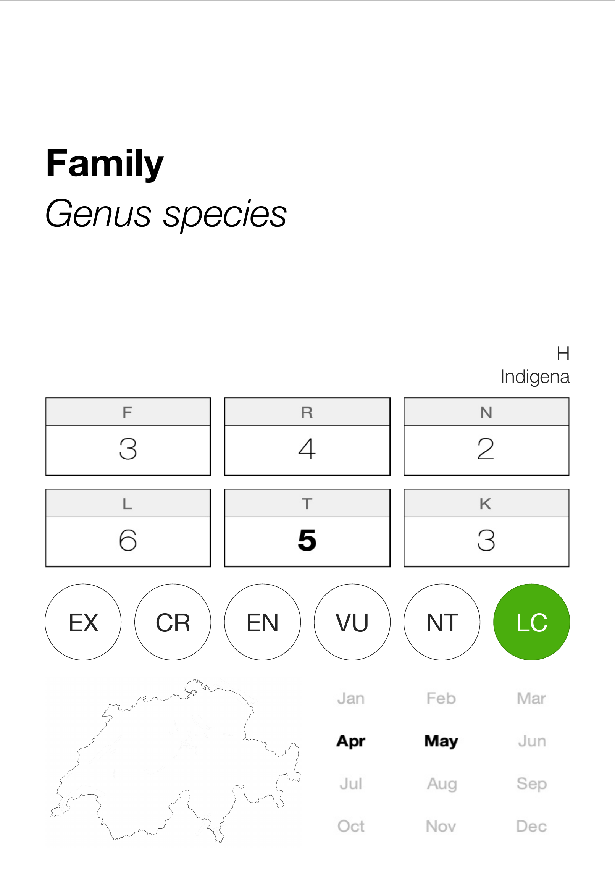

# Botanical Flashcard Pipeline

An automated pipeline for generating print-ready, duplex botanical flashcards
(label-style species cards) from InfoFlora (https://www.infoflora.ch) — the
Swiss national data centre for flora.

Given a list of species names, the pipeline automatically downloads photos,
distribution maps, ecological indicator charts, and flowering calendars, then
lays them out into a duplex-printable A4 PDF.

---

## Use cases

The input species list can be tailored to any botanical context. For example,
the pipeline is well suited to producing study cards for the Info Flora
botanical certifications (https://www.infoflora.ch/en/training/certifications.html)

Simply replace `species.xlsx` with a list matching the relevant species set.

---

## System requirements

- **Python 3.11+**
- Internet connection (scraping from infoflora.ch)
- **macOS**: uses the system font `HelveticaNeue.ttc` automatically
- **Linux / Windows**: `phase2.py` downloads the Inter font (free, SIL OFL
  licence) automatically on first run, saving it to `fonts/`

---

## Installation

```bash
python3 -m venv venv
source venv/bin/activate          # Windows: venv\Scripts\activate
pip install -r requirements.txt
```

---

## Usage

### Phase 1 — Scraping
```bash
venv/bin/python3 phase1.py species.xlsx
```

Downloads photos, maps, ecological data (Zeigerwerte), IUCN status, and
flowering calendars for every species in the input list. Produces:

- `output/species_output.xlsx` — enriched species table (input for Phase 2)
- `output/images_ext/` — main species photos
- `output/images_ext_candidates/` — alternative photo candidates (see below)
- `output/maps/` — distribution maps
- `output/zeigerwerte/` — ecological indicator charts
- `output/fioritura/` — flowering calendars

**Photo selection**: the algorithm scores and selects the best available photo
automatically. When no single photo scores above the confidence threshold, all
candidates are saved to `images_ext_candidates/<slug>/`. In that case, review
each species subfolder and copy your preferred photo to `images_ext/` before
running Phase 2. Skipping this step is fine but produces less curated output.

### Phase 2 — PDF generation
```bash
venv/bin/python3 phase2.py output/species_output.xlsx --solo-foto --lang it
```

Generates `species_output_stampa.pdf` — a duplex A4 PDF (front pages first,
then back pages) ready for long-edge double-sided printing and cutting.
`--solo-foto` restricts output to species that have a photo.

`--lang` (`it` / `en` / `de` / `fr`, default `it`) sets the language for the
card's translated text: Indigenat (origin), Lebensform (life form), and the
flowering-month chart. Flowering months are only re-rendered in the chosen
language for species scraped with a phase1 version that captured the raw
start/end months (`Fioritura_Start`/`Fioritura_End` columns) — older xlsx
files without them keep the pre-rendered chart as-is.

---

## Input file

`species.xlsx` must contain at minimum a column named **`Taxonname`** with the
full scientific name of each species (e.g. `Abies alba Mill.`).
Additional columns present in the SISF/Info Flora export are used automatically
when available.

---

## Output format

Each card is 68.2 × 99 mm (credit-card landscape). Eight cards fit per A4 sheet
(2 columns × 4 rows). The PDF is laid out for duplex long-edge printing:
front pages are column-mirrored so that fronts and backs align after printing.

### Example card

Blank template preview of a single card, front and back — placeholder photo
and generic text, no real species data (see [Disclaimer](#disclaimer) below):

<p>
  
  
</p>

---

## Disclaimer

This is an **unofficial, community-made tool** and is not affiliated with or
endorsed by Info Flora. All botanical data, distribution maps, ecological
indicators, and photos are sourced from https://www.infoflora.ch and remain
the property of Info Flora and the respective photo authors. This project
does not claim ownership of that content — the generated output credits each
photo to its original author (see the `Credit` field / printed attribution on
each card).
